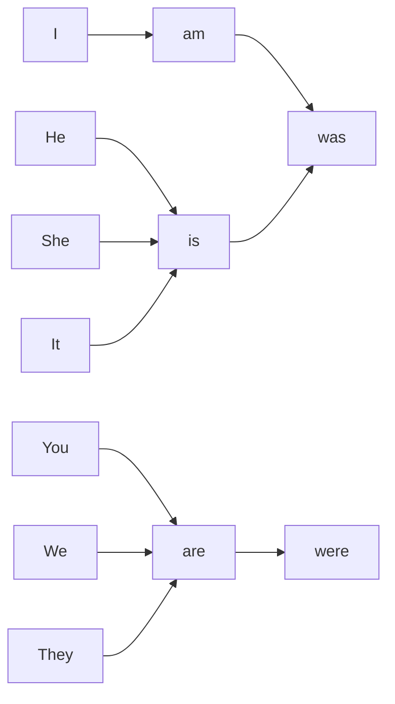

```diff
+ S + was/were + V(ing) - Obj
- S + was/were + not + V(ing)
? Was/were + S + V(ing)
```


```mermaid
flowchart LR
	I
	You
	We
	They
	He
	She
	It
	
	am
	are
	is
	
	was
	were

	I --> am --> was
	You & We & They --> are --> were
	He & She & It --> is --> was
```

Past continuous 는 전에 했었던 일을 