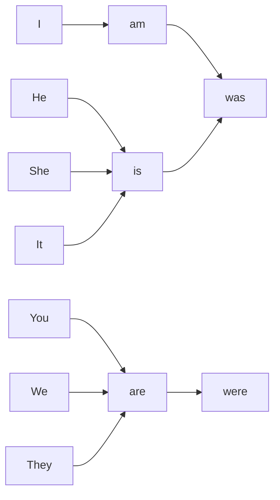

```diff
+ S + was/were + V(ing) - Obj
- S + was/were + not + V(ing)
? Was/were + S + V(ing)
```



Past continuous 는 전에 했었던 일을 지금 말하는 쓰이는 문법이다. 대충 ~하는 중이었다 이런느낌이다.

### Example
-  I was working last night
-  I was not working last night
- 