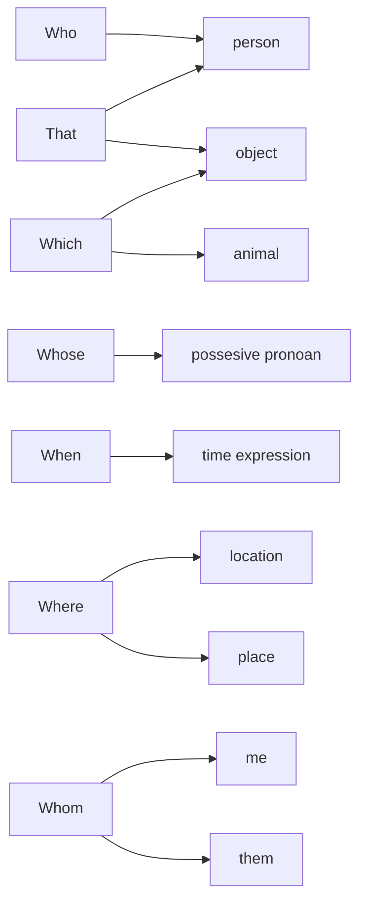

```mermaid
flowchart LR
	Who
	Which
	That
	Whose
	When
	Where
	
	person
	object
	animal
	pp["possesive pronoan"]
	me
	them
	te["time expression"]
	location
	place

	Who --> person
	Which --> object & animal
	That --> person & object
	Whose --> pp
	Whom --> me & them
	When --> te
	Where --> location & place
```

# Non defining relative clauses
### Example
- They are the people
- The people helped me
```mermaid

```